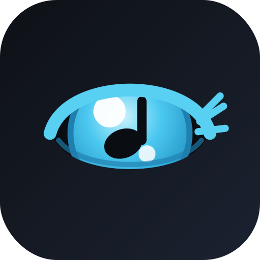

<p align="center">
  
</p>

<h1 align="center">Sightline</h1>

<p align="center"><em>Turn the pages of your sheet music with your eyes — so both hands stay on your instrument.</em></p>

<p align="center">
  ✔ Runs entirely in your browser &nbsp;·&nbsp; ✔ Nothing uploaded &nbsp;·&nbsp; ✔ No account &nbsp;·&nbsp; ✔ Free to host
</p>

---

Sightline watches where you're looking through your webcam and gently scrolls your
score so the music you're reading stays in a comfortable band on the screen. When
you reach the end of a line — or glance down at the next one — it turns the page for
you. No pedals to tap, no hands off the instrument.

Three ways to turn the page, pick whichever fits how you play:
- **Wink tracking** (default) — no calibration needed; wink your left eye to scroll up, your right to scroll down.
- **Iris tracking** — watches exactly where your eyes point for the most precise, natural page-following.
- **Auto-scroll (tempo-based)** — no camera at all; set your tempo and time signature and the page scrolls itself, like a metronome for sheet music.

## Contents

- [Try it](#try-it)
- [Quick start](#quick-start)
- [Your privacy](#your-privacy)
- [Using Sightline](#using-sightline)
- [Auto-scroll (time-based)](#auto-scroll-time-based)
- [Tuning](#tuning)
- [Getting the best accuracy](#getting-the-best-accuracy)
- [Troubleshooting](#troubleshooting)
- [Under the hood](#under-the-hood)
- [Requirements](#requirements)
- [Development](#development)
- [Host your own copy](#host-your-own-copy)
- [Credits & license](#credits--license)

## Try it

**Online (nothing to download):** Sightline is hosted for free on GitHub Pages at
**<https://wizoi.github.io/Sightline/>** — just open that link in Chrome or Edge on a
computer with a webcam. That's the recommended way to use it; no install, no build step,
nothing to keep up to date yourself.

Want to run your own copy or work on the code? See [Development](#development) and
[Host your own copy](#host-your-own-copy).

## Quick start

Sightline turns pages two independent ways — hands-free **eye/wink tracking** (below) or
**time-based auto-scroll**, which follows a tempo you set instead of your eyes. Switch between
them with the tabs at the top of the panel. This quick start covers eye/wink tracking; see
[Auto-scroll (time-based)](#auto-scroll-time-based) for the other.

1. **Load your music** — click *Load PDF* and choose any PDF of your score or part.
2. **Start the camera** — click *Start camera* and allow access when your browser asks.
3. **Calibrate** — nine dots appear; look at each one and click it, holding your gaze until it turns green. Do this sitting the way you'll actually play.
4. **Follow eyes** — click it (or press <kbd>Space</kbd>) and the page starts following you.
5. **Play!** Read normally; when you reach the end of a line or look at the next system, the page advances.

Calibration is saved, so next time you can skip straight to loading your music.

## Your privacy

**Everything happens on your own computer, inside your browser.** Your camera feed is used
only to work out where you're looking, moment to moment — it is never recorded, saved, or
sent anywhere. The same goes for your microphone if you turn on *Live tempo correction*: audio
is analyzed locally, in real time, and never recorded or uploaded. There is no account, no
server, and no upload. Close the tab and nothing is kept except your saved settings (which live
only in your browser).

## Using Sightline

**Tracking type** (in the **Eye/Wink** tab) picks how Sightline reads your intent to turn the page:
- **Wink tracking** (default) — no calibration needed to get started. Wink your **left** eye to scroll up, your **right** eye to scroll down; a *blink* (both eyes together) is ignored, only a one-eyed wink counts. **Wink scroll strength** controls how firm a push each wink gives. If winks are missed or blinks trigger by mistake, **Calibrate wink sensitivity** measures your own resting and winking eyes for a few seconds and sets personal thresholds instead of the one-size-fits-all default.
- **Iris tracking** — watches where your eyes point, via the 9-point calibration described above.

Switching tracking types is instant — pick whichever is more reliable for your face/lighting/glasses.

**The reading band** is the horizontal stripe where your current line sits (shown by default).
You choose where it sits on screen and how tall it is. You read within it; the page moves to
keep the music there.

**Turning the page** happens two ways, whichever feels natural: read to the **right edge** of
the band (you've finished the line), or simply **look down** at the next system. A brief hold
prevents accidental turns from a quick glance.

**Snap to systems** (optional) makes the page jump so a whole *system* (a full line of music —
including multi-instrument groups in a full score) lands centered in the band, instead of
scrolling by raw pixels. Turn on *Show detected systems* to see what it found.

**Pause instantly** with the spacebar — or with a **foot pedal**. A Bluetooth page-turner pedal
usually sends a mouse click, and a click anywhere on the music toggles pause. Handy for the
moments you look away and don't want the page to move.

**Recenter** (the <kbd>R</kbd> key or the button) pops a target in the middle of the band; look
at it for a second and tracking snaps back into alignment. **Drift** correction slowly keeps
you centered over a long sitting.

**Presets** let you save a whole setup (speed, band size, everything) per piece — a fast étude
and a slow ballad can each have their own feel.

## Auto-scroll (time-based)

An alternative to eye/wink tracking — instead of watching your eyes, the page scrolls in time
with a tempo you set, like a metronome for the page. Switch to it with the **🎵 Tempo** tab in
the panel (the two are alternatives — starting one automatically pauses the other).

1. **Load your music**, same as above.
2. **Scroll to your starting point** — wherever in the piece you want playback to begin.
3. **Set the time signature and tempo** — beats per measure and BPM.
4. **Analyze score** — Sightline scans the page for *systems* (a system is one line of music —
   see [Using Sightline](#using-sightline) for scores with multiple staves per line) and
   estimates how many measures are in each. Detection isn't perfect, especially on dense or
   unusually-spaced scores — check the **Measures per system** list it produces and fix any
   count that looks wrong; the schedule uses exactly what's there. If it spots a printed time
   signature it doesn't recognize with confidence, it may offer a **"detected — use this?"**
   suggestion instead of guessing — accept it or leave your own setting as-is. If your music
   prints its own tempo, Analyze also reads it and sets your starting Tempo to match
   automatically (and flags any later tempo changes it finds) — this happens right away, with
   no confirmation step, so if a change it shows doesn't match your actual music, it misread the
   page; just set the Tempo slider back to what you want.
5. **Pick a section, if there is one** — a combined "Score and Parts" PDF (a full conductor
   score followed by individual instrument parts, all in one file) gets split into named
   sections automatically, shown in a dropdown. Pick your own part and everything below —
   measures, tempo, playback — scopes to just that section, so you're not scheduled against
   the whole document. A plain single-part PDF has just one section and skips this entirely.
6. **Start auto-scroll** — the page scrolls and highlights the current system in time, starting
   from wherever you're scrolled to. **Pause** stops it in place; **Start** again resumes from
   your current scroll position, so you can nudge things while paused.
7. **Playback speed** nudges the overall pace up or down (50–150%) without re-entering a new
   BPM.

**Live tempo correction** is a toggle inside this tab. While auto-scroll is playing, it listens
through your microphone for note attacks and gently nudges the scroll speed to track your actual
playing tempo — a small, bounded correction, not full tempo-following. It shows a live status:
*listening* (mic connected, nothing heard yet), *tracking tempo* (actively adjusting), or *no
signal* (quiet for a while, e.g. during a rest). It's opt-in, off by default, and does nothing
while paused.

## Tuning

Every player, webcam, and room is a little different, so a minute with these sliders pays off.
They're grouped into **the reading band** and **how it scrolls**. A few only make sense for Iris
tracking (they watch a screen position, which Wink tracking doesn't have) and disappear from the
panel automatically when Wink tracking is active — that's expected, not a bug. **Eye-tracking
smoothing** and **Ignore glances past the sides** are tucked under the **Advanced** disclosure at
the bottom of the Eye/Wink tab rather than sitting loose in the main list.

| Slider | What it does | Turn it… |
|---|---|---|
| **Reading zone size** | Height of the band you read in | Up if it turns while you're still on a line; down to advance sooner |
| **Where you read on screen** | Band position, top ↔ middle | Toward the top for more look-ahead of what's coming |
| **Turn the page when my eyes reach…** *(Iris only)* | How far right before it advances | Left to turn earlier; right to require the very end of the line |
| **Page scroll speed** | How fast it moves | Up for quick page turns, down for slow passages |
| **Eye-tracking smoothing** *(Iris only, Advanced)* | Steady vs. responsive | Up if it jitters; down if it lags your eyes |
| **Wait before turning** | Delay before a turn commits | Up to ignore more stray glances; down for snappier turns |
| **Ignore glances past the sides** *(Iris only, Advanced)* | How close to the left/right edge still counts as reading, vs. looking away | Up if a glance toward the edge of the screen accidentally scrolls; down if it ignores real reading near the edges |
| **Music size** | Zoom of the score (100% = fit width) | Down to see more of the page at once; up to enlarge |

## Getting the best accuracy

Webcam eye-tracking isn't laser-precise, but a good setup makes it reliable:

- **Light your face** evenly (a lamp in front beats a bright window behind you).
- Put the **camera near eye level** and sit roughly **centered** in its view.
- Leave **Auto-frame** on — it zooms in on your face automatically so your eyes are well-resolved even if you sit back from the laptop.
- With **Iris tracking**, use **Check accuracy** (in the **Eye/Wink** tab): it shows you 7 targets and reports how close your gaze lands, whether up/down or sideways is weaker, and your room brightness — with specific fixes. Aim for "you'd land on the right line" being high.
- If it drifts mid-piece, tap <kbd>R</kbd> to recenter; if your setup changes (new camera, resized window), it'll suggest a quick recalibration. (Both are Iris-tracking concepts — Wink tracking has no drift to correct, since it never looks at a screen position.)

## Troubleshooting

**The camera won't turn on.** Allow camera access when prompted. Camera access requires a
secure context (HTTPS or `localhost`) — the hosted GitHub Pages link and `npm run dev` /
`npm run preview` both satisfy that automatically.

**It keeps scrolling when I look away (Iris tracking).** That's tracking drift. Add light, tap
<kbd>R</kbd> to recenter, or recalibrate — and use the pedal/spacebar pause when you glance away.
Running *Check accuracy* will tell you what's off.

**Snap won't advance.** Make sure a PDF is loaded and *Snap* is on; look down at the next
system and hold briefly. If your score has unusual spacing, turn on *Show detected systems* to
see whether it grouped the staves correctly.

**It feels inaccurate (Iris tracking).** Recalibrate slowly (hold your gaze on each dot), improve
lighting, and keep *Head-pose comp* on so moving your head doesn't throw it off.

**Wink tracking misses winks, or a blink triggers a page turn by mistake.** Run **Calibrate wink
sensitivity** (next to the Wink scroll strength slider) — it measures your own resting eyes and
each individual wink, and sets thresholds for your face instead of the shared default. Good,
even lighting on your face helps here too.

**Auto-scroll's measure counts look wrong.** Detection isn't perfect on dense, unusually-spaced,
or handwritten scores. Open **Measures per system** after analyzing and correct any counts by
hand — the schedule uses exactly what's there.

**Live tempo correction won't turn on, or keeps asking for the microphone.** Allow microphone
access when prompted — same secure-context requirement as the camera (HTTPS or `localhost`). It
also only does anything while auto-scroll is actually playing; while paused it just waits.

## Under the hood

<details>
<summary>Gaze tracking</summary>

Sightline uses Google's MediaPipe face-landmark model to locate your eyes and irises in the
webcam image. Rather than using raw iris position (which changes when you move your head), it
reconstructs where your eyes point **relative to your head** from the 3D face geometry, so
calibration survives you swaying and turning while you play. Blinks are detected and ignored.
</details>

<details>
<summary>Calibration</summary>

The nine calibration points fit a small **quadratic model** (plus the model's own eye-look
signals) mapping your eye direction to a point on screen, with feature standardization and
ridge regression so it stays stable and doesn't over-fit. The result is saved locally and
restored automatically; it's re-validated if your camera or window size changes.
</details>

<details>
<summary>Snap: detecting musical systems</summary>

For Snap mode, Sightline renders each page and finds the **staff lines** (long horizontal
strokes), clusters them into staves, then groups staves into systems — accepting the grouping
only when it's consistent. That's why a four-staff clarinet-quartet score snaps by whole
system, while a single-staff part snaps line by line.
</details>

<details>
<summary>Auto-scroll: measures and scheduling</summary>

Analyzing a score for auto-scroll reuses the same staff-line/system detection as Snap, then
scans each system's columns for **barlines** (tall vertical strokes) to estimate its measure
count. Those counts, together with your time signature and BPM, build a simple schedule — how
long each system should take — that the scroll position and highlight interpolate through
smoothly. If the PDF has no real text layer (a scanned or photographed page), the printed
measure numbers themselves are read back off the image via on-device OCR instead, as a more
accurate fallback than the barline estimate alone.
</details>

<details>
<summary>Sections: splitting a combined score</summary>

A PDF containing a full conductor score followed by individual instrument parts (a common
"Score and Parts" export) is automatically split into named sections, using the PDF's own real
embedded text — instrument names, tempo markings, and printed measure-number resets — rather
than guessing from pixels. Each section keeps its own measure counts, time signature, and tempo,
so picking your own part schedules auto-scroll against just that part, not the whole document. A
section detected only from a measure-number reset (no matching instrument name nearby) is
labeled as an auto-detected split rather than a real name, so an approximate boundary is never
presented as more certain than it is.
</details>

<details>
<summary>Live tempo correction</summary>

An [AudioWorklet](https://developer.mozilla.org/en-US/docs/Web/API/AudioWorklet) analyzes
microphone input off the main thread for note onsets, using a simple rising-energy detector
rather than full pitch or beat tracking. Each detected onset is compared to when the schedule
expected the next beat, and the timing error nudges a small, clamped correction multiplier
(0.85×–1.15×) rather than re-estimating tempo from scratch — much simpler and more robust, and
it decays back to neutral whenever playing stops, so a rest or a missed note can never leave a
stale correction stuck in place.
</details>

<details>
<summary>Camera zoom</summary>

Auto-frame crops and upscales the view around your face before detection so your eyes get more
pixels when you sit back — it follows your face and periodically widens to the full frame to
re-lock. If your webcam exposes a hardware zoom, the manual zoom uses that instead for real
optical detail.
</details>

<details>
<summary>Rendering</summary>

Mozilla's PDF.js renders your score into one tall scrollable column that Sightline scrolls
smoothly (or snaps to a system) based on whatever is currently driving it — your eyes, a wink, or
the auto-scroll schedule.
</details>

## Requirements

- A **desktop or laptop with a webcam**.
- **Chrome or Edge** (they support the camera and the face model well).

MediaPipe's face-tracking model and WASM runtime, and PDF.js, are all bundled with the app itself
and served from the same place as everything else — no third-party CDN requests, so school
networks that filter external domains won't block it.

No sample scores are included — load your own PDF. (PDFs are git-ignored so your music never
ends up in the repo.)

## Development

Sightline is a normal Vite-based static web app: plain JS modules, no framework, no server
component. The build output is still just static HTML/CSS/JS — Node/npm are only needed to
build it, not to run it.

```bash
npm install       # install dependencies
npm run dev        # start a local dev server with hot reload
npm test            # run the unit test suite (Vitest)
npm run lint          # lint with ESLint
npm run build           # production build → dist/
npm run preview          # serve the production build locally
```

**Accuracy over time:** Analyze-score detection is checked against a 39-file real-world corpus
(band parts, duets, full scores) on every meaningful change, comparing each PDF's actual systems/
sections/measures/tempo against hand-verified ground truth. Earliest snapshot vs. the latest one
on record:

| Detected correctly | 2026-07-20 (earliest) | 2026-07-23 (latest) |
|---|---|---|
| Systems (lines of music) | 80.6% | 92.9% |
| Section names (in multi-part PDFs) | 63.8% | 72.5% |
| Measures per system¹ | 3.1% | 83.8% |
| Printed tempo marks | 43.6% | 96.8% |

¹ Only counted on files where system detection itself was already correct (a prerequisite for a
fair per-system comparison) — 20 of 39 files at the earliest snapshot, 28 of 39 at the latest;
not yet measurable on the rest.

Run `npm run benchmark:report` for the full trend across every snapshotted commit, straight from
the committed history in `benchmarks/snapshots/` — no setup or personal music corpus needed, it
works right after cloning. See `scripts/benchmark/` for the runner that produces those snapshots
(it drives the app against a real, git-ignored corpus of PDFs — not something a clone needs in
order to just read the trend).

**Layout:**

- `src/lib/` — pure, dependency-free logic (calibration math, gaze math, staff/system
  detection, the follow-controller's decision logic). This is the part covered by unit
  tests, colocated as `*.test.js` next to each module.
- `src/` (top level) — the DOM-facing modules that wire that logic up to the page: camera
  capture, calibration UI, PDF rendering, the accuracy test, settings/presets, and the
  follow controller's per-frame loop.
- `src/appState.js` — the shared runtime state (calibration, toggles, camera state) that
  those modules read and write.

Pushing to `main` runs the test suite and, if it passes, builds and publishes the app — see
[Host your own copy](#host-your-own-copy).

## Host your own copy

**GitHub Pages** hosts Sightline for free with a shareable HTTPS link (HTTPS means the camera
works anywhere, no local-server step). A GitHub Actions workflow (`.github/workflows/deploy.yml`)
builds the app and publishes it to a `gh-pages` branch on every push to `main`:

1. Push this repo to GitHub and push to `main` at least once (or trigger the *Deploy to GitHub
   Pages* workflow manually) so the `gh-pages` branch gets created.
2. On GitHub: **Settings → Pages**.
3. Under *Build and deployment*, set **Source: Deploy from a branch**, **Branch: `gh-pages` /
   `(root)`**, and Save.
4. Wait a minute, then visit <https://wizoi.github.io/Sightline/>.

From then on, every push to `main` that passes tests automatically redeploys.

Share that link with anyone — they just open it and play.

## Credits & license

Built with [PDF.js](https://mozilla.github.io/pdf.js/) (Mozilla) and
[MediaPipe Tasks](https://developers.google.com/mediapipe) (Google).

Released under the [MIT License](LICENSE).
